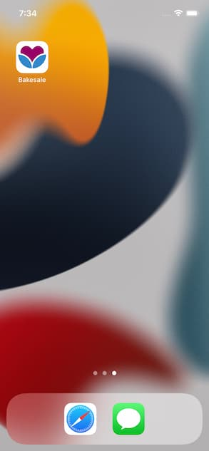
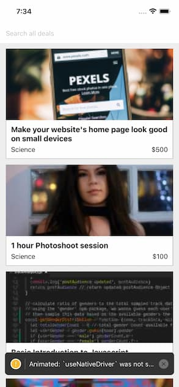

# Simple Mobile Application Using React Native
This application is from LinkedIn Learning React Native Essential Training. The app fetches data from https://bakesalegood.com to display deals available to users. Deals can be searched through a search bar. 

## Running iOS/Android Emulators 
`react-native run-ios`
`react-native run-android`
## Running React Native Dev Tools
`react-devtools`
## Install Image Asset Generator
[npm website link](https://www.npmjs.com/package/generator-rn-toolbox) 
`npm install -g yo generator-rn-toolbox`

## Generating Image Assets
`yo rn-toolbox:assets --icon icon.png`